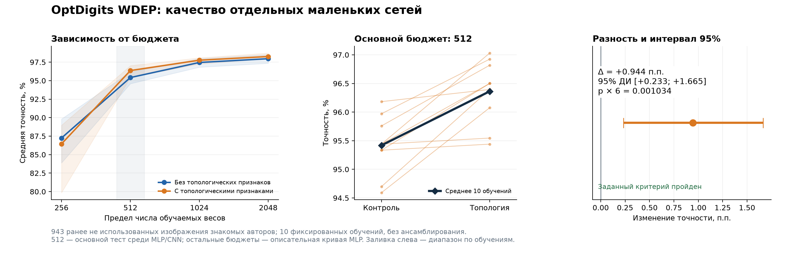
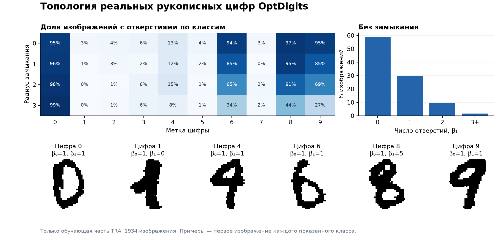

# Топологические признаки для сверхмалых нейросетей: фактический результат

Заранее зафиксированный критерий подтверждения пройден. На этом официальном тесте при бюджете не более 512 обучаемых весов топологическое представление улучшило среднюю точность относительно лучшего выбранного на валидации контроля из исследованных MLP и CNN.

**Основной результат:** контроль **95.419%**, топология **96.363%**; разность **+0.944 п.п.**, относительное уменьшение средней ошибки **20.60%**. Это среднее качество десяти отдельных обученных сетей, не ансамбль.

## Основной тест и неопределённость

- Официальный OptDigits WDEP: **943 изображения**, ранее не использовавшиеся в этой работе. Это новые изображения авторов почерка, присутствующих в обучении.
- Топологическая модель: `mlp`, `b512_pixels_topology_early_d1_o0`, **508** обучаемых весов, **105** эпох при окончательном обучении.
- Контроль: `mlp`, `b512_pixels_geometry_early_d1_o1`, **508** обучаемых весов, **33** эпох. Геометрические и градиентные признаки разрешены контролям; подбираются также сети без дополнительных признаков.
- Разность средних: **+0.944 п.п.**; перекрёстный бутстрэп по изображениям и парным обучениям даёт 95% интервал **[+0.233; +1.665] п.п.**
- Односторонний точный тест перемены знаков по изображениям: **p = 0.00017231517**; поправка на шесть итоговых сравнений в исследовательской серии: **p × 6 = 0.001033891**.
- Топология лучше в **10 из 10** пар обучений.
- Заданный критерий: положительная разность, исправленное p ≤ 0,05, нижняя граница интервала > 0 и минимум 8 положительных пар. **Пройден: да.**

Проверка значимости условна относительно обменности методов на уровне изображений. Идентификаторы авторов отдельных записей отсутствуют: зависимость изображений одного автора полностью не учтена, а новое независимое подтверждение переноса на новых авторов здесь не получено. Описательная перепроверка на уже использованном WINDЕP приведена отдельно. Десять обучений не превращают 943 изображения в 9430 независимых наблюдений. Единица перестановочного теста — изображение; неопределённость обучения дополнительно отражена бутстрэпом и отдельными результатами.

## Что происходит при изменении бюджета

| Предел весов | Фактически: контроль / топология | Контроль | Топология | Разность, п.п. | Статус |
|---:|---:|---:|---:|---:|---|
| 256 | 235 / 240 | 87.243% | 86.448% | -0.795 | Описательный результат |
| 512 | 508 / 508 | 95.419% | 96.363% | +0.944 | Основной тест |
| 1024 | 1006 / 1006 | 97.455% | 97.762% | +0.308 | Описательный результат |
| 2048 | 1917 / 1909 | 97.964% | 98.261% | +0.297 | Описательный результат |

Бюджет 512 был выбран как основной до начала маленьких MLP. Дополнительные точки 256, 1024 и 2048, а также правило их выбора были зафиксированы до открытия WDEP; на этих трёх бюджетах рассматриваются только MLP. Они показывают описательную зависимость от размера, но не являются тремя дополнительными попытками объявить значимое открытие. Малый бюджет сам по себе не гарантирует преимущество топологии.

## Дополнительная проверка на новых авторах почерка

Те же 20 готовых моделей основного сравнения, без переобучения, выбора удачного запуска или калибровки, проверены на 1797 изображениях официального WINDЕP. Этот набор **уже использовался ранее в исследовании**, поэтому здесь он служит только описательной проверкой переноса. План этой перепроверки записан до открытия нового WDEP; она не меняет основной критерий и не заменяет его.

Средняя точность контроля: **92.443%**; топологии: **93.940%**; разность **+1.497 п.п.** Топология лучше в **10 из 10** пар обучений. Результат направлен в ту же сторону, что основной тест. Отдельного утверждения о статистической значимости или свежем независимом подтверждении по повторно использованному набору не делается.

## Как устроен модуль

Из исходного бинарного изображения 32×32 вычисляются 64 средних по блокам 4×4. Фиксированный модуль дополнительно возвращает число компонент и отверстий для исходной маски и её морфологических замыканий с дисковыми радиусами 1, 2, 3 — всего восемь признаков. Контроль аналогичной размерности использует площади и периметры тех же четырёх масок. Метки классов в извлечение признаков не входят.

Для варианта MLP с шестью скрытыми нейронами:

\[
f(M)=W_2\operatorname{ReLU}(W_1[\widetilde x;0.3\widetilde\phi(M)]+b_1)+b_2,
\qquad 72\cdot6+6+6\cdot10+10=508.
\]

Числа Бетти относятся к формам отдельных изображений. Мы не измеряем зацепление распределений классов и не доказываем, что какая-либо архитектура в принципе не способна решить задачу. Полные формулы, модель клеточного комплекса и границы утверждений — в [математическом описании](mathematics_and_prior_work_ru.md).

На обучающей части TRA отверстия есть у **41.05%** изображений; несколько компонент — у **0.103%**. При этом маленькие пиксельные отверстия могут быть шумом: число Бетти цифры «8» не обязано равняться двум. Поэтому используется профиль нескольких обработанных масок.

## Протокол и проверки

Разработка: 1934 изображения TRA и 946 изображений CV. Проведены **456 допустимых обучений MLP** при четырёх бюджетах и **288 обучений компактных CNN** при бюджете 512. Проверялись раннее и позднее объединение признаков, один или два скрытых слоя MLP, пиксели и градиентные признаки; у CNN — обычные свёртки с двумя вариантами головы и разделённые по каналам свёртки, сдвиги изображения и несколько скоростей обучения. Все обучаемые веса дополнительных ветвей включены в ограничение.

24 из первоначально перечисленных MLP-обучений оказались алгебраически невозможны: при заданном входе и позднем объединении один скрытый нейрон уже превышал бюджет 256. Они исключены по формуле числа весов, не по качеству. Сохранились все 456 допустимых результатов; остановка и восстановление очереди отражены в журнале исполнения.

Внутри топологической и контрольной групп выбран максимум средней точности трёх CV-обучений; при равенстве — меньшая кросс-энтропия, число параметров и лексикографический идентификатор. Модели переобучены на всех 2880 изображениях TRA+CV с десятью заранее заданными инициализациями. Число эпох — медиана выбранных CV-эпох; останова по тесту нет. Всего перед тестом заморожено 80 моделей для основного сравнения и описательной кривой.

Сохранены протоколы, SHA-256 исходников и данных, все выбранные веса, вероятности и результаты каждого обучения. Отдельный запуск повторил предсказания выбранных CV-моделей. **Все 744 файла валидационных предсказаний** проверены на соответствие точности и функции потерь. Вероятности теста зафиксированы до вычисления метрик; формат данных содержит метки рядом с изображениями, парсер читает их, но построение предсказаний ими не пользуется.

Итоговые точности пересчитаны независимым аудитом. Точное p независимо совпало при двух вычислениях распределения: динамическим программированием по изображениям и свёрткой сгруппированных биномиальных распределений. Числа отверстий проверены независимым подсчётом компонент фона. Полных совпадений TEST-картинок с TRA+CV: **0**; повторов внутри TEST: **0**. Официальный состав теста после его открытия не менялся.

### По отдельным обучениям основного сравнения

| Инициализация | Контроль | Топология | Разность, п.п. |
|---:|---:|---:|---:|
| 0 | 95.440% | 97.031% | +1.591 |
| 1 | 95.440% | 95.546% | +0.106 |
| 2 | 96.182% | 96.394% | +0.212 |
| 3 | 94.698% | 96.394% | +1.697 |
| 4 | 95.440% | 96.501% | +1.060 |
| 5 | 95.758% | 96.819% | +1.060 |
| 6 | 95.334% | 96.501% | +1.166 |
| 7 | 95.970% | 96.925% | +0.954 |
| 8 | 95.334% | 95.440% | +0.106 |
| 9 | 94.592% | 96.076% | +1.485 |

### Разработка MLP, не независимое подтверждение

| Бюджет | Лучший контроль CV | Лучшая топология CV | Разность, п.п. |
|---:|---:|---:|---:|
| 256 | 86.434% | 86.857% | +0.423 |
| 512 | 95.102% | 96.054% | +0.951 |
| 1024 | 97.075% | 97.639% | +0.564 |
| 2048 | 98.203% | 98.309% | +0.106 |

Лучшая CNN без топологии получила на CV 92.319%; лучшая CNN с топологией — 93.658%. Все итоговые выборы сделаны до чтения WDEP.

## Стоимость и границы результата

**Выигрыш числа обучаемых параметров не равен ускорению.** При чередующемся пакетном измерении на 256 TRAIN-изображениях извлечение топологических признаков занимало медианно **0.465 мс/изображение**, геометрических — **0.349 мс/изображение**. Это текущая реализация на CPU при параллельном обучении других моделей; индивидуальная задержка, энергия и встроенное устройство не измерены. Поэтому выигрыш времени не заявляется.

Экспорт с включением стандартизации в матрицы весов: topology: 508 float32, 2032 байт; baseline: 508 float32, 2032 байт. При экспорте использована заранее определённая инициализация 0, а не лучшая на тесте. Результаты классификации всех 946 CV-изображений до и после включения стандартизации совпали. Память фиксированного алгоритма, рабочие массивы и код учитываются дополнительно.

Результат относится к перечисленным семействам сетей, бюджетам и разбивке OptDigits. Не установлены превосходство над всеми возможными компактными архитектурами, результат мирового уровня, общая нижняя граница нужной ширины или преимущество на новых авторах почерка. Предыдущий независимый опыт на USPS преимущества топологии не подтвердил; этот результат не следует распространять на него.

## Источники и воспроизведение

[OptDigits, UCI, Alpaydin & Kaynak, 1998](https://archive.ics.uci.edu/dataset/80/optical+recognition+of+handwritten+digits), лицензия CC BY 4.0. Использован исходный набор изображений, а не только готовая таблица признаков 8×8. Топологические признаки для нейросетевого распознавания цифр встречаются уже в [Weideman et al., 1995](https://pubmed.ncbi.nlm.nih.gov/18263445/); приоритет самой идеи не заявляется. Связь с [курсами МЦНМО](https://old.mccme.ru/circles/oim/home/combtop13.htm): клеточные комплексы, эйлерова характеристика, связность и гомологии.

Основные машиночитаемые материалы: `tiny_confirmation_protocol.json`, `tiny_confirmation_test_results.json`, `tiny_confirmation_predictions.npz`, `tiny_confirmation_final_audit.json`, `tiny_complete_development_audit.json`. История выбора и все результаты разработки сохранены в `tiny_mlp_validation.json` и `tiny_cnn_validation.json`. Сопоставление со старым большим исследованием использует поправку на шесть итоговых тестов, записанную до открытия WDEP.
